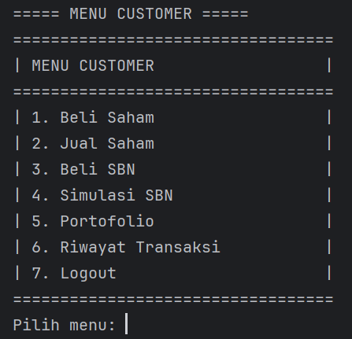

<!DOCTYPE html>
<html lang="id">
<head>
    <meta charset="UTF-8">
    <meta name="viewport" content="width=device-width, initial-scale=1.0">
</head>
<body>
    <header>
        <h1><strong>Program Investasi</strong></h1>
    </header>
  
  

        
Halo! Program ini kami rancang untuk menyelesaikan tugas dari mata kuliah PBO (Pemrograman Berbasis Objek) kami.

  

            <h3>Perkenalkan kami:</h3>
            <ul>
                <li><strong>Ni Made Rita Mutiara Dewi</strong> (2405551009 || PBO B)</li>
                <li><strong>Putu Lidya Paramita Sunu</strong> (2405551075 || PBO B)</li>
            </ul>
        

  
Program ini adalah aplikasi investasi sederhana berbasis command line yang memungkinkan pengguna melakukan investasi saham dan Surat Berharga Negara (SBN). Program ini menggunakan bahasa pemrograman Java yang dirancang untuk dua jenis user dengan akses yang berbeda, yaitu:

        <ol>
            <li><strong>Admin</strong> diberikan akses untuk melihat semua portofolio, memperbarui data saham, dan mengelola SBN.</li>
            <li><strong>Customer</strong> diberikan akses untuk melihat portofolio mereka, membeli/menjual saham, dan membeli SBN.</li>
        </ol>
        
Program ini juga dilengkapi dengan input validasi untuk memastikan pengguna memberikan input yang sesuai dengan yang dibutuhkan oleh program.

  
Berikut uraian sistem, cara kerja, dan diagram UML yang telah dilengkapi komentar untuk mempermudah pemahaman alur pemakaian program. Silakan disimak!

    

   

        <h2><strong>UML</strong></h2>
        

            
        

    

  

        <h2><strong>TEORI PADA PROGRAM INVESTASI</strong></h2>
        
Program investasi mengimplementasikan prinsip-prinsip Object Oriented Programming (OOP) sebagai berikut.

        
   <ol>
            <li>
                <h3><strong>Kelas dan Objek</strong></h3>
                
Program ini menggunakan kelas untuk mendefinisikan entitas seperti Saham, User, Admin, dan Customer, yang masing-masing memiliki atribut dan perilaku tertentu. Sedangkan, objek adalah instansi dari kelas-kelas ini yang digunakan untuk berinteraksi dengan data dalam program.

            </li>
            
   <li>
                <h3><strong>Pewarisan (<em>Inheritance</em>)</strong></h3>
                
Admin dan Customer mewarisi atribut dan metode dasar dari kelas User, memungkinkan keduanya berbagi fitur umum namun tetap dapat menambahkan fungsionalitas khusus untuk masing-masing tipe pengguna.

            </li>
            
  <li>
                <h3><strong>Polimorfisme (<em>Polymorphism</em>)</strong></h3>
                
Polimorfisme memungkinkan objek dari kelas turunan (Admin dan Customer) diperlakukan sebagai objek kelas induk (User), yang mempermudah proses seperti login yang sama untuk semua tipe pengguna, meskipun ada perbedaan perilaku.

            </li>
            
  <li>
                <h3><strong>Abstraksi (<em>Abstraction</em>)</strong></h3>
                
Program menyembunyikan detail implementasi dengan menyediakan antarmuka sederhana yang hanya menampilkan fungsionalitas penting, seperti metode untuk menambah saham atau membeli SBN tanpa perlu tahu bagaimana proses tersebut dikelola di dalam kelas.

            </li>
            
  <li>
                <h3><strong>Enkapsulasi (<em>Encapsulation</em>)</strong></h3>
                
<em>Encapsulation</em> membatasi akses langsung ke data internal dan hanya memungkinkan perubahan melalui metode getter dan setter, menjaga data tetap aman dan terkontrol.

            </li>
            
   <li>
                <h3><strong>Komposisi (<em>Composition</em>)</strong></h3>
                
Komposisi terlihat ketika objek Transaksi berisi objek lain seperti Saham atau SBN, yang menunjukkan hubungan antara transaksi dan entitas terkait yang terlibat dalam investasi.

            </li>
            
   <li>
                <h3><strong><em>Overloading</em></strong></h3>
                
Metode seperti tambahSaham() di kelas SahamFitur menggunakan overloading, di mana metode yang sama dapat memiliki parameter yang berbeda untuk fleksibilitas dalam menambahkan saham dengan cara yang lebih beragam.

            </li>
            
  <li>
                <h3><strong>Penggunaan Koleksi (<em>Collections</em>)</strong></h3>
                
ArrayList digunakan untuk menyimpan dan mengelola daftar objek seperti Saham, SBN, dan Transaksi, yang memungkinkan pengelolaan data yang lebih dinamis dan fleksibel.

            </li>
            
  <li>
                <h3><strong>Flow Control</strong></h3>
                
Flow control dalam program investasi digunakan untuk mengendalikan jalannya program dan mengarahkan alur program berdasarkan kondisi atau input yang diberikan oleh pengguna.

            </li>
        </ol>
    

  

        <h2><strong>ALUR PEMAKAIAN PROGRAM</strong></h2>
        
Berikut cara penggunaan program investasi beserta tampilan hasil eksekusi programnya. Petunjuk penggunaan disertakan untuk memandu pengguna.

  

            
Pertama, saat aplikasi dijalankan, akan muncul layar login. Silakan pilih 1 untuk login atau 0 untuk logout.

            

                
<strong>Catatan</strong>: Untuk login sebagai admin, gunakan username: "admin" dan password: "admin123". Untuk customer, gunakan username: "customer" dan password: "customer123"

            

                
            

                
            

                
        

  <h1><strong>Sebagai Admin</strong></h1>
        
        
  

            
Di menu Admin, Anda sebagai admin memiliki tiga pilihan yaitu:

            <ul>
                <li><strong>Pilihan 1</strong>: Masuk ke menu Pengelolaan Saham</li>
                <li><strong>Pilihan 2</strong>: Masuk ke menu Pengelolaan Surat Berharga Negara</li>
                <li><strong>Pilihan 3</strong>: Keluar dari akun admin</li>
            </ul>
            
        

  

            
Jika Anda memilih angka 1 pada menu Admin, Anda akan masuk ke menu Pengelolaan Saham.

            
            
  
Pilih angka 1 untuk menambahkan saham baru ke dalam sistem. Anda akan diminta memasukkan informasi saham. Sistem akan memproses permintaan Anda dan menampilkan pesan konfirmasi bahwa saham berhasil ditambahkan.

            
            
  
Jika Anda memilih angka 2 pada menu Admin, Anda akan masuk ke menu Pengelolaan Harga Saham untuk mengubah harga saham.

            
            
  
Sistem akan menampilkan daftar saham yang tersedia pada program.

    
            
  
Kemudian, Anda diminta untuk memasukkan kode saham yang akan diperbarui dan harga barunya. Jika proses berhasil, Anda akan melihat pesan bahwa harga saham berhasil diubah menjadi harga barunya.

            
        

  

            
Jika Anda memilih angka 2 dari menu Admin, Anda akan masuk ke menu Pengelolaan SBN.

            
            
  
Pilih angka 1 untuk menambahkan SBN baru ke dalam sistem.

            
            
  
Anda akan diminta memasukkan informasi SBN. Setelah informasi diproses, sistem akan menampilkan pesan konfirmasi bahwa SBN yang baru telah berhasil ditambahkan.

            
        

            
Untuk keluar dari mode admin, pilih angka 3 dari menu Admin.

        

  <h1><strong>Sebagai Customer</strong></h1>
        
        
  

            
Di menu Customer, Anda sebagai Customer memiliki tujuh pilihan sebagai berikut:

            <ul>
                <li><strong>Pilihan 1</strong>: Masuk ke menu Beli Saham untuk membeli saham yang tersedia di pasar.</li>
                <li><strong>Pilihan 2</strong>: Masuk ke menu Jual Saham untuk menjual saham yang Anda miliki.</li>
                <li><strong>Pilihan 3</strong>: Masuk ke menu Beli SBN untuk membeli Surat Berharga Negara (SBN) yang tersedia.</li>
                <li><strong>Pilihan 4</strong>: Masuk ke menu Simulasi SBN untuk menghitung estimasi keuntungan dari investasi SBN.</li>
                <li><strong>Pilihan 5</strong>: Lihat Portofolio untuk melihat daftar saham dan SBN yang Anda miliki serta total nilai investasi.</li>
                <li><strong>Pilihan 6</strong>: Lihat Riwayat Transaksi untuk melihat daftar transaksi yang telah Anda lakukan, baik untuk saham maupun SBN.</li>
                <li><strong>Pilihan 7</strong>: Logout untuk keluar dari akun Anda dan kembali ke layar login.</li>
            </ul>
            
        

  

            
Jika Anda memilih angka 1 pada menu Customer, Anda akan masuk ke menu Beli Saham. Pada menu ini Anda dapat melihat daftar saham yang tersedia untuk dibeli, memilih saham yang diinginkan, dan memasukkan jumlah lembar saham yang ingin dibeli.

            
            
   
Setelah memilih saham yang diinginkan, Anda akan diminta untuk memasukkan kode saham dan jumlah lembar saham yang ingin Anda beli. Jika stok saham cukup, transaksi akan diproses dan saham yang Anda beli akan ditambahkan ke portofolio Anda. Jika transaksi berhasil, Anda akan menerima konfirmasi bahwa saham berhasil dibeli.

            
        

  

            
Jika Anda memilih angka 2 pada menu Customer, Anda akan masuk ke menu Jual Saham.

            
            
  
Kemudian, Anda akan diminta untuk memilih saham yang ingin dijual dari portofolio Anda.

            
            
  
Setelah memilih saham, masukkan kode saham dan jumlah lembar yang ingin dijual. Jika transaksi berhasil, saham yang dijual akan dihapus dari portofolio Anda dan Anda akan menerima konfirmasi penjualan berhasil.

            
        

            
Jika Anda memilih angka 3 pada menu Customer, Anda akan masuk ke menu Beli SBN.

            
            
  
Anda akan diminta untuk memilih Surat Berharga Negara (SBN) yang ingin dibeli dari daftar yang tersedia.

            
            
  
Setelah memilih SBN, masukkan nominal pembelian yang diinginkan. Jika pembelian berhasil, Anda akan menerima konfirmasi bahwa pembelian SBN telah dilakukan dan nominal investasi Anda akan diperbarui.

            
        

  

            
Jika Anda memilih angka 4 pada menu Customer, Anda akan masuk ke menu Simulasi SBN.

            
            
  
Anda akan diminta untuk memilih Surat Berharga Negara (SBN) dari daftar yang tersedia. Setelah memilih SBN, masukkan nominal investasi yang ingin disimulasikan.

            
            
   
Sistem kemudian akan menghitung dan menampilkan estimasi hasil investasi berdasarkan bunga dan jangka waktu yang berlaku untuk SBN yang dipilih.

            
        

  

            
Jika Anda memilih angka 5 pada menu Customer, Anda akan masuk ke menu Portofolio.

            
            
   
Pada Portofolio Anda dapat melihat daftar kepemilikan saham dan SBN yang telah Anda beli, lengkap dengan jumlah lembar saham atau nominal investasi, nilai saat ini, serta estimasi keuntungan atau kerugian. Menu ini memberikan gambaran menyeluruh tentang aset investasi Anda di program.

            
        

 

            
Jika Anda memilih angka 6 pada menu Customer, Anda akan masuk ke menu Riwayat Transaksi.

            
            
  
Di dalamnya terdapat tiga pilihan:

            <ul>
                <li><strong>Pilihan 1</strong>: Lihat semua transaksi</li>
                <li><strong>Pilihan 2</strong>: Cari transaksi berdasarkan kode</li>
                <li><strong>Pilihan 3</strong>: Logout</li>
            </ul>
            
            
   
Jika Anda memilih angka 1 pada menu Riwayat Transaksi, Anda akan masuk ke menu Lihat Semua Transaksi.

            
            
            
 
Jika Anda memilih angka 1 pada menu Riwayat Transaksi, semua riwayat transaksi Anda akan ditampilkan. Ini mencakup pembelian dan penjualan saham maupun pembelian SBN yang pernah Anda lakukan.

            
            
  
Jika Anda memilih angka 2 pada menu Riwayat Transaksi, Anda akan masuk ke menu Cari Transaksi Berdasarkan Kode.

            
            
  
Anda akan diminta memasukkan kode saham atau nama SBN. Setelah itu, program akan menampilkan riwayat transaksi yang sesuai dengan kode atau nama yang Anda cari.

            
            
  
Jika Anda memilih angka 3 pada menu Riwayat Transaksi, Anda akan kembali ke menu Customer.

            
        

  

            
Untuk keluar dari mode customer, pilih angka 7 dari menu Customer.

        

    

</body>
</html>
